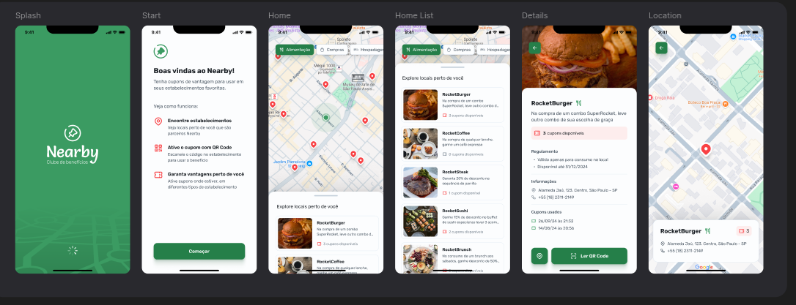

<p align="center">
   
</p>

# NLW POCKET REACT NATIVE EXPO - Nearby

#### :postbox: About

- Project created in NLW Pocket, simulates search for nearby places with coupons

#### :pushpin: Prototype

- [Figma](https://www.figma.com/community/file/1448070647757721748)
- [Official Repository](https://github.com/rocketseat-education/nlw-pocket-mobile-rn/tree/bebd88335f7586cde42fecc74b6ef9d5940b5f13)

#### :rocket: Stacks

- [React Native with Expo](https://docs.expo.dev/)
- [React Query](https://tanstack.com/query/latest/docs/framework/react/overview)
- [React Native Maps](https://github.com/react-native-maps/react-native-maps#readme)

##### 🤷 How Running ?

1 - Run API

```
# select node version
nvm use

# open api folder
cd api/nlw-pocket-mobile-api-main

# install dependecies
npm install

# run api
npm start
```

2 - Run Mobile App

```
# select node version
nvm use

# open mobile folder
cd mobile

# install dependecies
yarn

# run expo
yarn start

# download expo go
https://expo.dev/go

# scan the QR Code with your device or open it in your simulator
```
